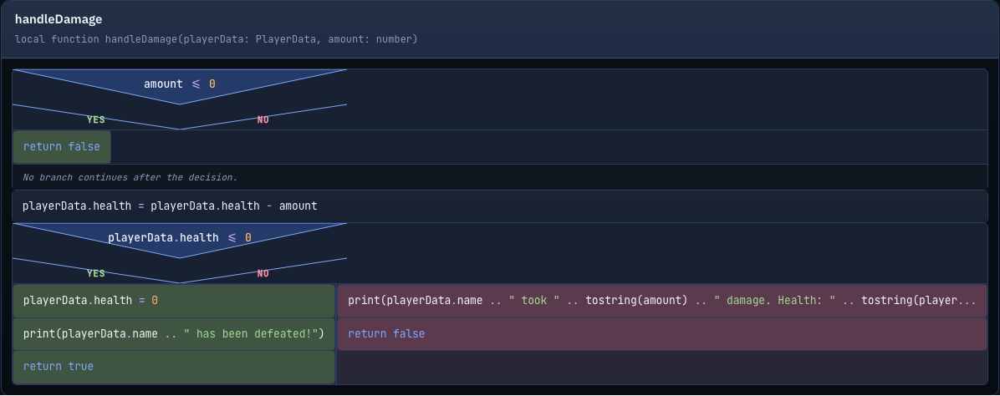

# Luau Viewer

Luau Viewer is a monolith for parsing Luau source code through ANTLR and rendering Nassi-Shneiderman control flow diagrams, built with a clean hexagonal architecture.

The project starts from the domain, not from the framework:

- **business goal**: convert Luau source into a stable structural model and visual control flow diagrams
- **architectural style**: DDD-inspired layered monolith with hexagonal boundaries
- **parser engine**: ANTLR4 with the Luau grammar from [bivex/luau-grammar-antlr4](https://github.com/bivex/luau-grammar-antlr4)
- **current delivery channel**: CLI that parses files/directories (JSON), builds NSD diagrams (HTML), and detects code smells (JSON)

## What the system does

- **Parsing Luau code**
  - parsing one `.luau` or `.lua` file
  - parsing a directory of Luau files
  - extracting a structural model: imports, type aliases, constants, variables, functions, local functions
  - reporting syntax diagnostics as part of the contract

- **Control flow extraction**
  - if/elseif/else statements with nested branches
  - while loops
  - numeric for loops (`for i = 1, n`)
  - generic for-in loops (`for k, v in pairs(t)`)
  - repeat-until loops
  - closures and function calls

- **Nassi-Shneiderman diagrams**
  - building NSD HTML diagrams for one file or entire directories
  - classic NS rendering with SVG triangles for if-blocks
  - depth-coded nested ifs (up to 50 levels with color cycling and Unicode badges)
  - dark Tokyo Night-inspired theme with JetBrains Mono font
  - responsive layout
  - syntax highlighting for Luau keywords, strings, numbers, operators, and comments
  - collapsible function panels
  - table of contents sidebar for files with 10+ functions
  - shared CSS across directory bundles
  - "Back to Index" navigation in directory mode

- **Code smell detection**
  - static analysis on the extracted control flow model (not raw text)
  - configurable thresholds via CLI flags
  - JSON output with per-file and aggregated summaries

## Screenshots

**Directory index** — generated `nassi-dir` output for [Adonis](https://github.com/Sceleratis/Adonis):


**NSD diagram** — `Fun.luau` from Adonis with syntax highlighting, loops, and nested ifs:



**Nested depth** — `Admin.luau` with depth-colored if-blocks and closures:


## Quick Start

1. Install dependencies:

```bash
uv sync --extra dev
uv pip install -e .
```

2. Generate the Luau parser:

```bash
uv run python scripts/generate_luau_parser.py
```

3. Parse a single file:

```bash
uv run luau-viewer parse-file path/to/module.luau
```

4. Parse a directory:

```bash
uv run luau-viewer parse-dir path/to/project
```

5. Build a Nassi-Shneiderman diagram for a file:

```bash
uv run luau-viewer nassi-file path/to/module.luau --out output/module.nassi.html
```

6. Build NSD diagrams for an entire directory:

```bash
uv run luau-viewer nassi-dir path/to/project --out output/nassi-bundle
```

7. Detect code smells in a file:

```bash
uv run luau-viewer smell-file path/to/module.luau
```

8. Detect code smells across a project:

```bash
uv run luau-viewer smell-dir path/to/project
uv run luau-viewer smell-dir path/to/project --max-nesting-depth 3 --max-function-steps 30
```

## Code Smells

Detected from the control flow step tree — no raw text analysis.

| Smell | Severity | Trigger |
|-------|:--------:|---------|
| `unreachable` | ERROR | Steps after `return`/`break`/`continue` in same sequence |
| `empty-then` | WARNING | `if` with empty then body |
| `deep-nesting` | WARNING | if/else nesting exceeds threshold (default: 4) |
| `infinite-loop` | WARNING | `while true` without break/return in body |
| `empty-function` | INFO | Function with zero steps |
| `long-function` | WARNING | Function exceeds step threshold (default: 50) |
| `deprecated-api` | WARNING | `spawn()`, `delay()`, `wait()` instead of `task.*` |
| `wait-in-loop` | WARNING | Any `wait` inside loop body (performance hit in Roblox) |

### CLI flags

| Flag | Default | Description |
|------|:-------:|-------------|
| `--max-nesting-depth` | 4 | Maximum allowed if/else nesting depth |
| `--max-function-steps` | 50 | Maximum allowed steps per function |

### Output format

`smell-file` returns per-file JSON:
```json
{
  "source_location": "path/to/file.luau",
  "smell_count": 3,
  "summary": { "error": 1, "warning": 1, "info": 1 },
  "smells": [
    { "rule": "unreachable", "severity": "error", "message": "...", "function": "processItems", "line": null }
  ]
}
```

`smell-dir` returns aggregated JSON across all files with `file_count`, `total_smells`, and per-file breakdowns.

## Architecture

The codebase is split into four explicit layers:

- `domain` - domain model, invariants, ports, and domain events
- `application` - use cases and DTOs
- `infrastructure` - ANTLR adapter, filesystem adapters, rendering, smell detection, event publishing
- `presentation` - CLI contract

Three independent feature axes share `SourceRepository` but have separate ports, services, and DTOs:

- **Parsing** (`parse-file`, `parse-dir`) — structural model extraction
- **Diagrams** (`nassi-file`, `nassi-dir`) — NSD HTML rendering
- **Smells** (`smell-file`, `smell-dir`) — code smell detection

## Next Steps

- richer control flow visualization (type annotations, table destructuring)
- symbol graph export
- semantic passes on top of the structural model
- export to other diagram formats (SVG, PNG, Mermaid)
- incremental parsing and caching
