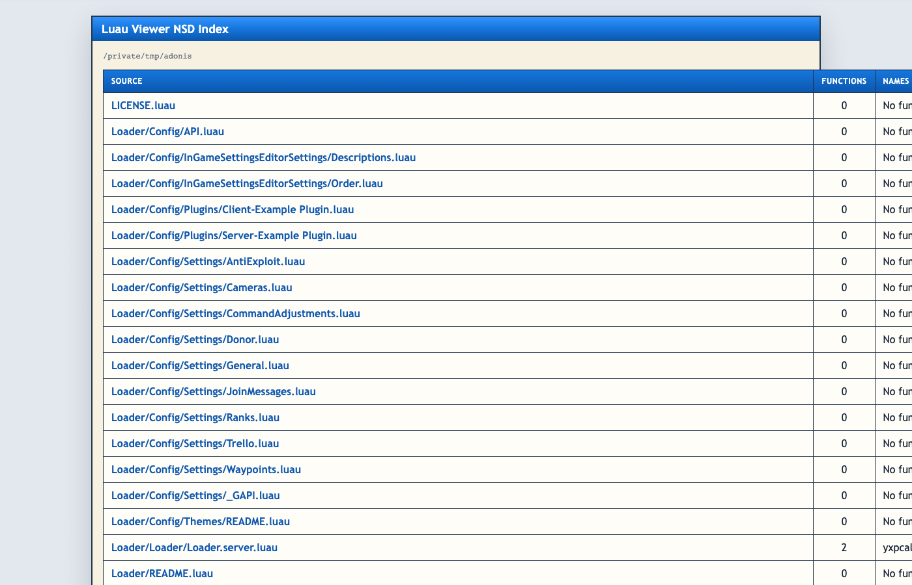

# Luau Viewer

Luau Viewer is a monolith for parsing Luau source code through ANTLR and rendering Nassi-Shneiderman control flow diagrams, built with a clean hexagonal architecture.

The project starts from the domain, not from the framework:

- **business goal**: convert Luau source into a stable structural model and visual control flow diagrams
- **architectural style**: DDD-inspired layered monolith with hexagonal boundaries
- **parser engine**: ANTLR4 with the Luau grammar from [bivex/luau-grammar-antlr4](https://github.com/bivex/luau-grammar-antlr4)
- **current delivery channel**: CLI that parses files/directories (JSON) and builds NSD diagrams (HTML)

## What the system does

- **Parsing Luau code**
  - parsing one `.luau` or `.lua` file
  - parsing a directory of Luau files
  - extracting a structural model: imports, type aliases, constants, variables, functions, local functions
  - reporting syntax diagnostics as part of the contract

- **Control flow extraction**
  - if/elseif/else statements with nested branches
  - while loops
  - numeric for loops (`for i = 1, n`)
  - generic for-in loops (`for k, v in pairs(t)`)
  - repeat-until loops
  - closures and function calls

- **Nassi-Shneiderman diagrams**
  - building NSD HTML diagrams for one file or entire directories
  - classic NS rendering with SVG triangles for if-blocks
  - depth-coded nested ifs (up to 50 levels with color cycling and Unicode badges)
  - dark Tokyo Night-inspired theme with JetBrains Mono font
  - responsive layout
  - syntax highlighting for Luau keywords, strings, numbers, operators, and comments
  - collapsible function panels
  - table of contents sidebar for files with 10+ functions
  - shared CSS across directory bundles
  - "Back to Index" navigation in directory mode

## Screenshot



## Quick Start

1. Install dependencies:

```bash
uv sync --extra dev
uv pip install -e .
```

2. Generate the Luau parser:

```bash
uv run python scripts/generate_luau_parser.py
```

3. Parse a single file:

```bash
uv run luau-viewer parse-file path/to/module.luau
```

4. Parse a directory:

```bash
uv run luau-viewer parse-dir path/to/project
```

5. Build a Nassi-Shneiderman diagram for a file:

```bash
uv run luau-viewer nassi-file path/to/module.luau --out output/module.nassi.html
```

6. Build NSD diagrams for an entire directory:

```bash
uv run luau-viewer nassi-dir path/to/project --out output/nassi-bundle
```

## Architecture

The codebase is split into four explicit layers:

- `domain` - domain model, invariants, ports, and domain events
- `application` - use cases and DTOs
- `infrastructure` - ANTLR adapter, filesystem adapters, rendering, event publishing
- `presentation` - CLI contract

## Next Steps

- richer control flow visualization (type annotations, table destructuring)
- symbol graph export
- semantic passes on top of the structural model
- export to other diagram formats (SVG, PNG, Mermaid)
- incremental parsing and caching
